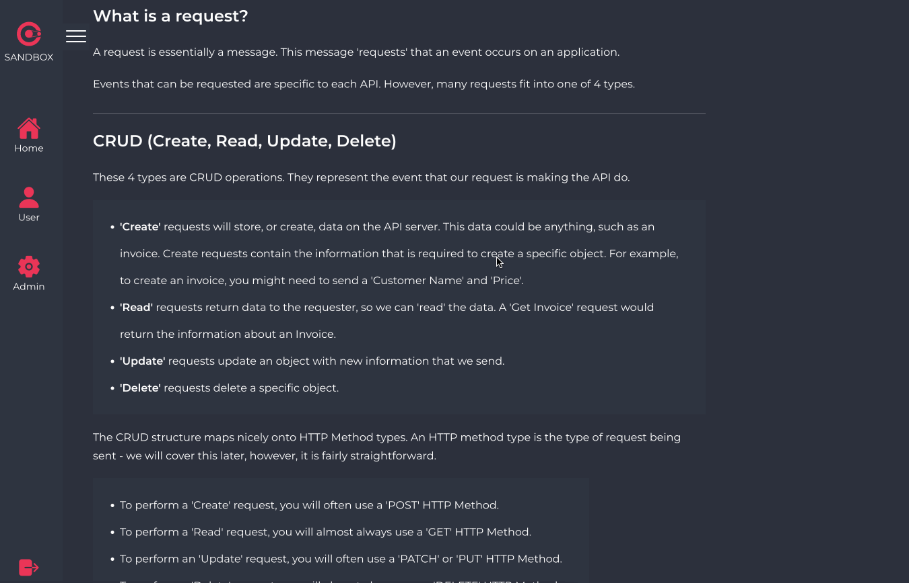
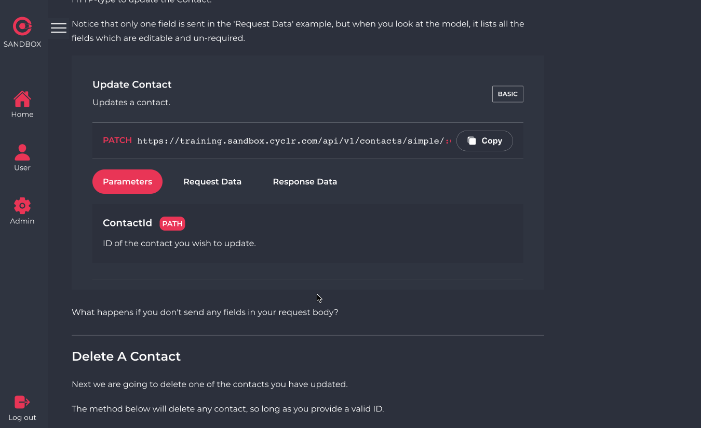
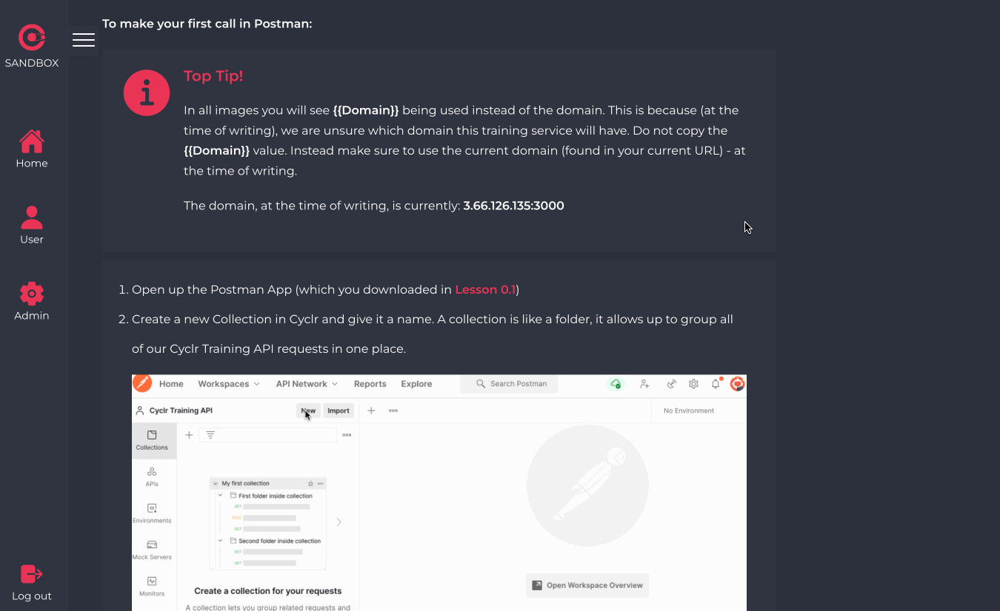

# Improving Onboarding by 200%+

### From a 2 week onboarding to a 4 day onboarding

<figure>
    
    <figcaption>Login Page</figcaption>
</figure>

## Quick Intro

At Cyclr, an iPaaS company which provides a zero-code integration platform to businesses, I develop and maintain integrations.

Cyclr is a growing company with recent investment.

However, with each new developer, begins a period of onboarding - getting them up to speed with our tools and processes.

This can take up to 2 weeks per new starter.

These 2 weeks consisted of working with a developer to build integrations on Public APIs.
The developer would try to explain each aspect of the problem, without any structure, and would be jumping between the topics which related to the current problem.

## This had some issues:

- New developers' learning processes were unstructured. Learning can be sped up by building on top of the skills of each lesson, rather than jumping between topics.
- Developers had to think reactively to explain each topic as it appeared, which is not the best way to teach consisely and clearly.
- Developers found that a lot of the content they were teaching was identical between new starters. If it's repeatable - it should be automated.
- New developers had little time to reflect and revise what they had just learned, as they were jumping between topics.

## The Solution

I presented the solution during a company-wide meeting a few weeks ago. This covered the problem and how it has been solved. Video below:

<figure>
<iframe width="560" height="315" src="https://www.youtube.com/embed/A3Baww3lEBI" title="YouTube video player" frameborder="0" allow="accelerometer; autoplay; clipboard-write; encrypted-media; gyroscope; picture-in-picture" allowfullscreen></iframe>
</figure>

## The Tech

The entire App was built using a single NodeJS server using Express.

MongoDB was used as the document-based structured mirrors the familiar response structure of JSON APIs.

Since Connector Developers will become familiar with that structure, this will mean they are easily able to support the project on the DB-front.

<figure>
    
    <figcaption>Lesson & Chapter Menu</figcaption>
</figure>

It was developed using Docker to provide portability. GitHub actions were set up to automatically build and transpose a new docker image into Kubernetes on a successful pull request.

Webpack was used to keep the bundling from /src to /public in a single place, however the Webpack flow included multiple stages of parsing for markdown files.

## Custom Markdown Parsing

The 'markdown-it-loader' package enabled me to integrate markdown-it to HTML parsing easily.

However, I wanted to develop custom markdown blocks for different situations:

<pre>
::: mermaid
Graph LR
A(Variable)-->B(Other)
:::
</pre>

and parse these into HTML-ready blocks, with pre-defined styling variables and more.

To do that, I used the following, or similar for other blocks, with each markdown-it loader stage:

<pre>
render: function (tokens, idx) {
    const me = tokens[idx].info.trim().match('mermaid');
    let markup = '';
    if (me) {
        markup = `<\div class="mermaid">%%
        {init: {'theme': 'base', 'themeVariables': 
            { 
        'darkMode': true,
        'primaryColor': '#ea3556',
        'edgeLabelBackground':'#ea3556',  
        'primaryBorderColor': '#ea3556', 
        'lineColor': '#ea3556', 
        'mainBkg': '#ea3556', 
        'fontSize': '20px'
        }}}%%\n` +
        tokens[idx + 2].children.map((child, i) => {
            if (i === 0) return child.content + '\n';
            if (child.tag === 'br') return;
            return '  ' + child.content + '\n';
            }).join('') + '</ div>';
        tokens[idx + 2].children = [];
    }
    return markup;
},
</pre>

Whilst it does the job, in hindsight, this could have been structured in a nicer way so when we return to update the process, it is clearer. This has been added to the project's trello.

<figure>
    
    <figcaption>Custom Parsed Quiz Module</figcaption>
</figure>

## Embedded Documentation

I was surprised to find no existing way to embed documentation from a Postman collection so developed a module to do just that.

When a user loads a lesson, custom-parsed method blocks (from the previous section) force an API call. The API call returns the relevent methods documentation from an exported Postman collection.

This way, the documentation is easily maintainable and editable in 1 place.

<figure>
    
    <figcaption>Embedded Postman Documentation</figcaption>
</figure>

The data provided, terminology used and styling resemble API documentation Connector Developers should be decoding in their role.

## The Results

The plan was to utilise Cyclr Sandbox in the week after the presentation, when we were joined by two new Connector Developers.

We prepared a structured feedback system, with the majority of feedback being loaded straight into a Trello board.

The onboarding process was far more steamlined and effective. This was assessed by feedback from the starters, who enjoyed the mastery-style curriculum and found the challenges enjoyable.

The fact that we covered all the available content within the first 4 days of their onboarding was remarkable. I had expected at least 7 - 10 days.

These 4 days matched around three weeks worth of dedicated teaching using our previous onboarding processess and Public APIs.

After those 4 days, the new starters were independently working on the sprint, with an awareness of building custom-connectors in Cyclr.

<figure>
    
    <figcaption>More Embedded Components</figcaption>
</figure>

## Join Us

Cyclr is a rapidly growing company based across London, Brighton and Eastbourne. If you're interested in joining us, please check out our [Hiring Page](https://cyclr.com/we-are-hiring).
